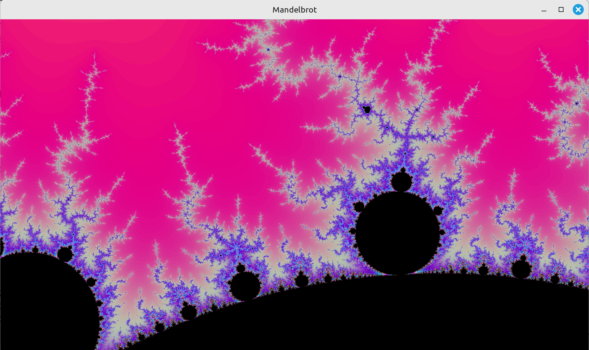
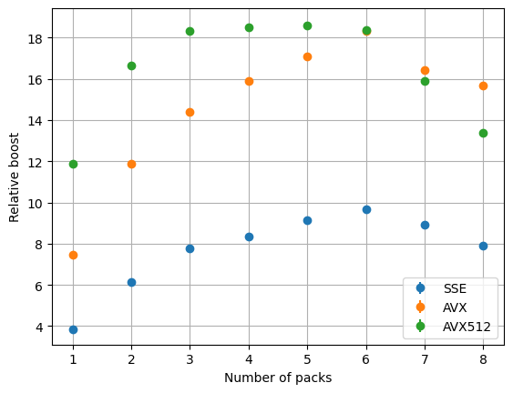
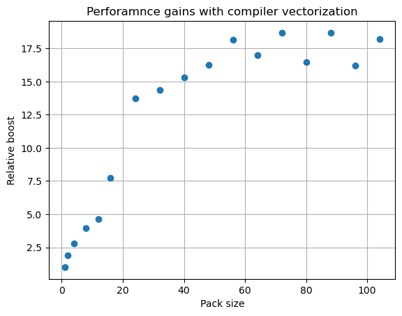
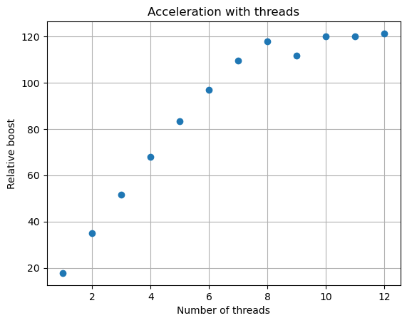

# Mandelbrot set with SIMD optimizations

Mandelbrot set explorer with intuitive controls and stunning optimizations!



## Compiling

+ Tune parameters in [mandelbrot.h](include/mandelbrot.h)

    **1. Select type of floating point number to use in calculations**

    Uncomment line with type you want: float or double, and comment other line

    ```c
    #define MANDELBROT_FLOAT
    // #define MANDELBROT_DOUBLE
    ```

    **2. Choose size of MM register**

    ```c
    #define MM_SIZE 256    // size of current mm register
    ```

    + `128` - `xmm` registers provided with `SSE` instruction set. Almost all modern CPUs have that instruction set.
    + `256` - `ymm` registers --> `AVX/AVX2` instruction set. Again, chances high your processor supports it.
    + `512` - `zmm` registers --> `AVX512` instruction set. Check your processor specs (CPUID) for `AVX512` flags. Only high-end CPUs (often with iGPU) support it.

    Generally, higher = better, but you are free to try and find best option

    **3. Choose number of packs with floats in mm registers to use in one iteration**

    ```c
    #define MM_PACKS 2
    ```

    Doing more commands without jumps helps CPU to conveyorize intsructions and perform much faster. On AVX512 optimal number seems to be 5.

    **4. Modern compilers are smart enough to convert loops into vector instructions. This parameter controls number of points processed simultaneously.**

    ```c
    #define AUTO_VEC_PACK_SIZE 32
    ```

    Use __multiples__ of powers of 2 (4, 8, 16, ...)  

    Best results are often get when `AUTO_VEC_PACK_SIZE` is x2 or x4 of floats you can put in one MM register.

    + For example: `AVX2` -> `256 bits` + `float (32bits)` -> `8` floats in `ymm` ---> `AUTO_VEC_PACK_SIZE = 32`
    **5. Choose number of threads**

    ```c
    const int THREAD_POOL_SIZE = 4;
    ```

    Mandelbrot set will be rendered in parallel.

+ **Choose screen resolution and render function in [main.cpp](src/main.cpp)**

    ```c
    const int WIDTH  = 1920;    // in pixels
    const int HEIGHT = 1080;
    const mandelbrotFunc_t mandelbrotRenderer = calculateMandelbrotOptimized;
    ```

    **Note:** `WIDTH` must be divisible by `AUTO_VEC_PACK_SIZE` and `MM_SIZE`/8. Otherwise program will change resolution to compatible in runtime.

    **Available render functions:**
  + `calculateMandelbrot` - no optimizations
  + `calculateMandelbrotOptimized` - manual optimization with SIMD intrinsics
  + `calculateMandelbrotAutoVec` - version optimized by compiler
  + `calculateMandelbrotThreaded` - SIMD optimized version that runs in parallel

+ **Dependencies**

    [SFML](https://sfml-dev.org) 2.x.x (2.5.1 or newer)

    Makefile was configured for unix systems.

+ Run

    ```bash
    mkdir build
    make
    ```

    In case of compilation error try to decrease `MM_SIZE`.

## Usage

```bash
./mandelbrot.exe
```

Controls:

+ Zoom with mouse wheel and move image while holding left mouse button
+ Alternative:
  + wasd - move image
  + up and down arrows: zoom in and out
+ Left and right arrows: decrease and increase number of iterations
+ Ctrl+C: copy current position and scale to the clipboard
+ Ctrl+V: paste position and scale from clipboard
+ Escape: close

Test mode:

Pass number of tests as argument in command line. Result will be appended to the `tests.md`.

## Performance comparison

Test device: `Lenovo XiaoXin X16 Pro (2024)`

+ CPU: `AMD Ryzen 7 8845H w/ Radeon 780M Graphics 3.80 GHz` (8 cores, 16 threads)
+ Compilers:
    + `g++ 13.3.0`
    + `clang++ 18.1.3`

+ OS: `Linux Mint 22.1 x86_64`

I compared 4 versions with different optimization technics:

### 1.Basic version with naive approach

Calculating one pixel per one iteration.

### 2.SIMD optimized version

Multiple pixels are calculated simultaneously in one iteration using single-instruction-multiple-data intrinsics.

As mentioned earlier, there's support for different instruction sets and you can control loop unrolling to use advantage of conveyor.

### 3.Automatic compiler vectorization

Multiple independent pixels calculations are merged in loops in one iteration: almost like naive implementation, but each operation with numbers is a loop. Compiler will unroll these loops and in some cases use vector instructions.

### 4.Threaded version

Proof-of-concept realization: using C++ `thread` library to spawn multiple threads that will calculate pixels in parallel using SIMD optimized version. I have implented some kind of thread pool: each thread takes constant number of rows of pixels and processes them, while incrementing shared value of current row that is ready to be calculated.

### Test conditions and compiling flags

We will not discuss perforamnce gains that we get by using -O3 instead of -O0 beyond this paragraph, but here are some numbers for naive(1) implementation:

| -O0    | -O3    |
| -----  | -----  |
| 704 ms | 247 ms |

x2.85 boost is already impressive, but we could do much better.

All further test results are relative to naive(1) implementation with -O3. Image is rendered in 1920x1080\* resolution with `256 maximum iterations`, center of the screen is `(-0.5, 0)`, width of the plane is `3.5`.

\* There are some tests where width was changed because it must be divisible by pack sizes, and in some tests change was huge, for example: 1920->8320. That mostly doesn't affect relative performance, though. You can see detailed raw test results in [test_results.md](test_results.md)

Time was measured by sf::Clock, each function was tested many times in a loop, error was calculated as standard deviation. All graphs were created using matplotlib, [jupyter notebook](resultGraphs.ipynb)
 

### Exploring conveyor limits

I've conducted test with number of packs from 1 to 8. Here's graph with relative speed up for different instruction sets. Using `float` for floating-point numbers.



Speed up relative to base(1) realization. Error for each value does not exceed 0.05

|        | SSE           | AVX         | AVX512    |
| ---    | -------       | ---------   | -------   |
| 1 pack | 3.86          | 7.45        | 11.89     |
| Best   | 9.67          | **18.32**   | **18.61** |

When number of packs equals 1 results are almost as expected: xmm register contains 4 floats, so calculations are sped up by 3.86 times. With ymm acceleration is 7.45 times. AVX512 performs 11.89, which is not that close to 16, but still great.

Best acceleration is obtained with number of packs 6 for SSE and AVX and 5 for AVX512. (Note that my CPU has 32 xmm/ymm/zmm registers).

Just by unrolling vector instructions you could improve performance up to 2.5(!) times.

It was unexpected to see that AVX could get really close to AVX512 and performance gains between them are nearly negligible.

### What compiler could do



This graph shows how inconsistent compiler optimizations are. Most performance is gained when switching from 16 to 64 pack size: g++ figures out that zmm registers will be much better.

Best optimizations are achieved with pack size of 48: **x18.16**\*

\*There are points on graph with higher boost: up to 18.67. However, these points correspond to different screen resolution and manual SIMD optimization was still better in these tests.

### Honorable mention: threads



Using thread pool we could achieve total improvement by **120 times**.

Comparing to single-threaded SIMD-optimized version, it is almost x6.8 times faster.

Probable explanation: on 8-core CPU one core is used by OS, other 7 could calculate mandelbrot set.

## Conclusion

By using intrinsics and conveyorizing them mandelbrot set performance could be increased by **18.5** times. Compiler vectorization is slightly worse than manual optimization: **x18** boost. Threads could rocket up FPS: **x120** times calculation time decrease.
